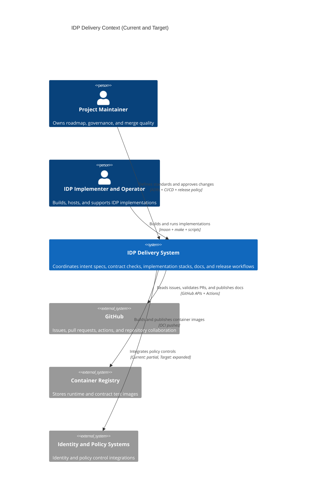

# Level 1: Delivery Context (Current and Target)

This view shows delivery-system context for maintainers and implementers. It is
the companion to the user-first Level 1 views.

## Audience

- Primary: IDP project maintainers and IDP implementers/operators.
- Secondary: advanced users who need delivery governance context.

## State

- Current: repository-driven workflows and stack operations used today.
- Target: expanded policy integration and stronger automated delivery controls.

## Notes

- This diagram is intentionally delivery-focused and separate from user context.
- Most readers should start with user-first Level 1 diagrams.
