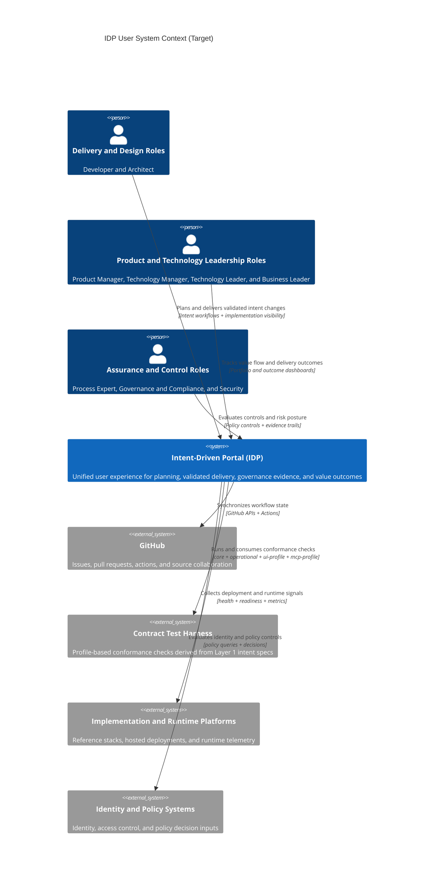

# Level 1: User System Context (Target)

This view shows target IDP context from the user perspective. It extends current
capabilities with stronger planning, governance, and value reporting while
keeping user outcomes primary.

## Audience

- Primary: IDP users and decision stakeholders.
- Secondary: implementers and maintainers planning platform evolution.

## State

- Current: see [Level 1: User System Context (Current)](./level-1-system-context).
- Target: intended user-centered context after capability expansion.

## Role Mapping

| Role cluster | Concrete roles | Target user goal |
| --- | --- | --- |
| Delivery and design roles | Developer, Architect | Plan, execute, and validate changes with trusted guidance and fast feedback |
| Product and technology leadership roles | Product Manager, Technology Manager, Technology Leader, Business Leader | Manage value outcomes, strategic priorities, and delivery health |
| Assurance and control roles | Process Expert, Governance and Compliance, Security | Enforce controls, review risk, and maintain auditable evidence |

## Notes

- Target-state context is implementation-agnostic and aligned to ADR direction.
- Layered intent, contract, and implementation separation remains unchanged.
