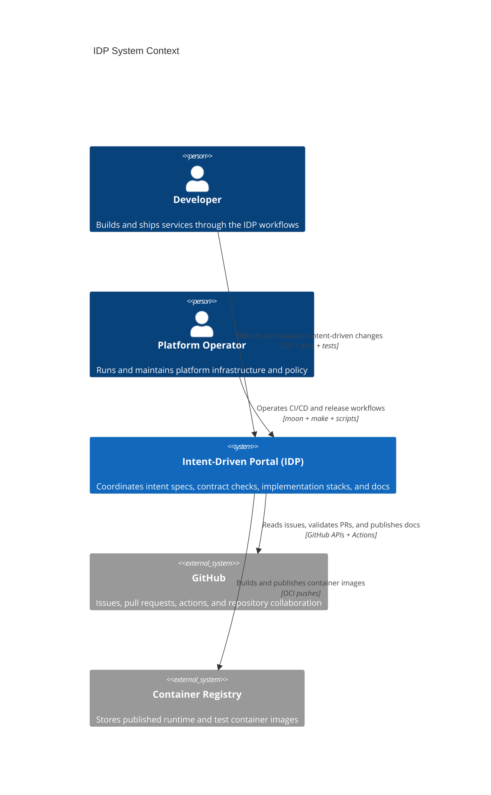

# Level 1: System Context

This view explains who uses IDP and which external platforms it depends on. It
is the highest-level map and is intended for quick orientation.

## Notes

- `tests/features/*.feature` files are the Layer 1 intent source of truth.
- `tests/src/` contract harness code is Layer 2 validation against implementations.
- `stacks/` contains Layer 3 runtime implementations.
