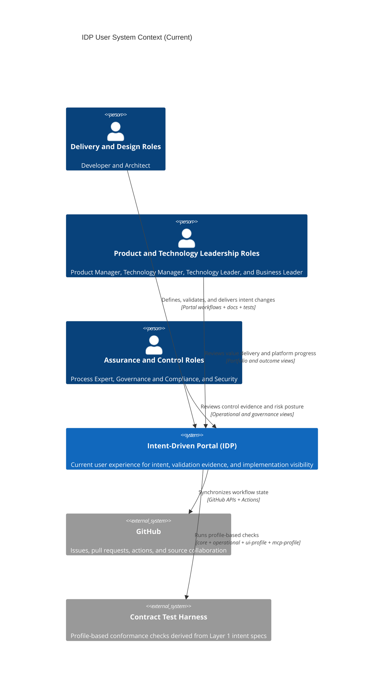

# Level 1: User System Context (Current)

This view shows current IDP context from the user perspective. Delivery
mechanics are present, but user outcomes and decision needs remain primary.

## Audience

- Primary: IDP users and decision stakeholders.
- Secondary: implementers and maintainers who need user-outcome context.

## State

- Current: reflects behavior available in the repository today.
- Target: see [Level 1: User System Context (Target)](./level-1-system-context-target).

## Role Mapping

| Role cluster | Concrete roles | Primary user goal |
| --- | --- | --- |
| Delivery and design roles | Developer, Architect | Move intent from design to validated implementation with fast feedback |
| Product and technology leadership roles | Product Manager, Technology Manager, Technology Leader, Business Leader | Track value delivery, priorities, and cross-team execution health |
| Assurance and control roles | Process Expert, Governance and Compliance, Security | Confirm policy adherence, risk controls, and audit readiness |

## Notes

- `tests/features/*.feature` files are the Layer 1 intent source of truth.
- `tests/src/` contract harness code is Layer 2 validation against implementations.
- `stacks/` contains Layer 3 runtime implementations.
