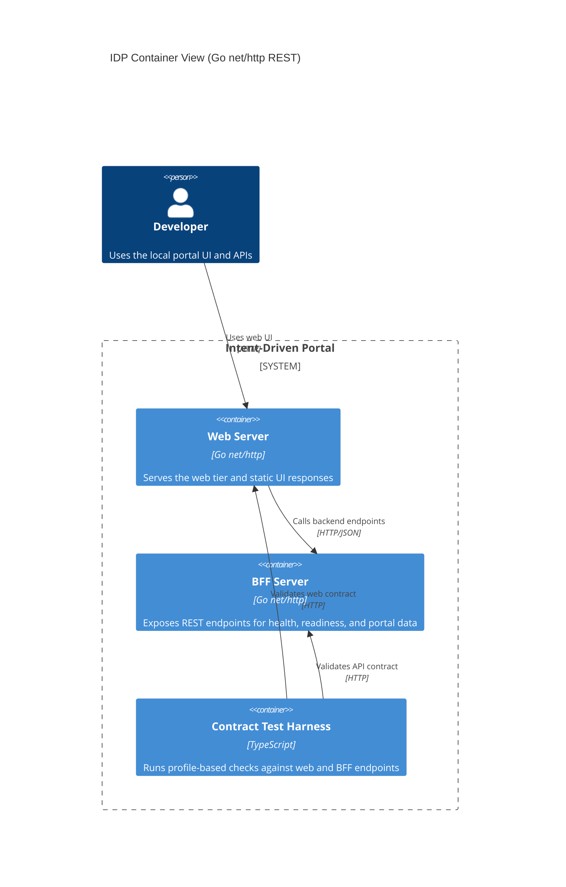

# Level 2: Containers (Go net/http stack)

This view shows the deployable parts of the default Go reference stack and how
traffic flows between user, web server, and BFF.

## Notes

- Default local host bindings are loopback (`127.0.0.1`) per ADR-0006.
- This stack declares `core` and `operational` contract profiles.
