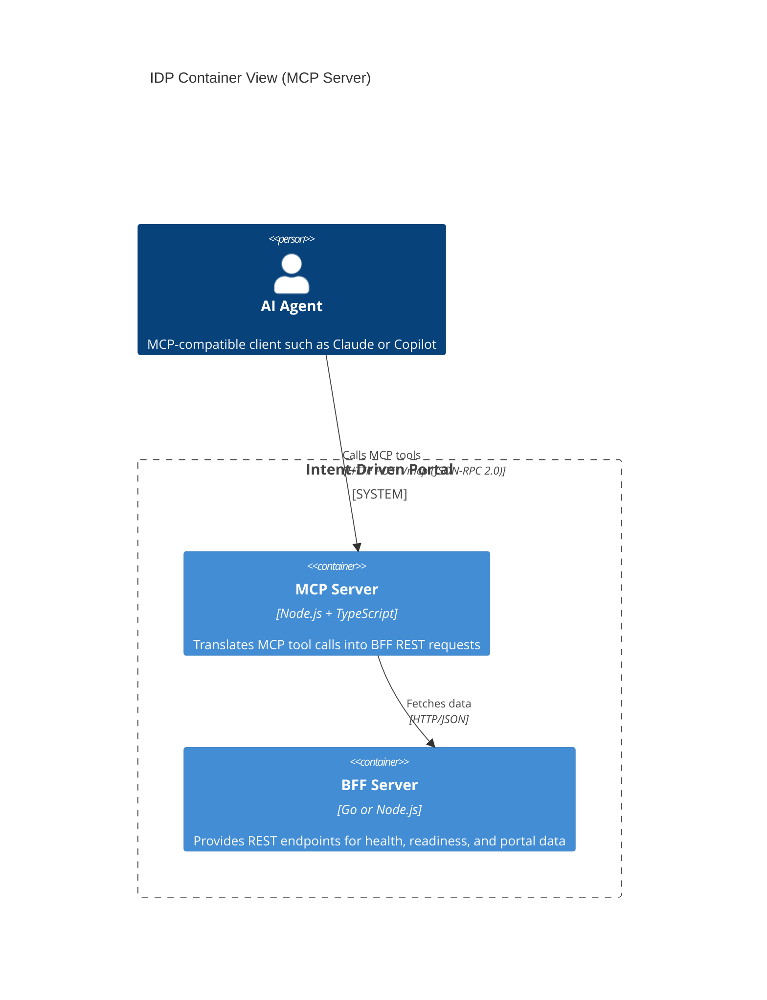

# Level 2: Containers (MCP Server)

This view shows the MCP server and how AI agents interact with the portal
through it. The MCP server is a standalone adapter that works with any BFF
stack — Go or Node.js.

## Notes

- The MCP server is located at `tools/mcp/` and is stack-independent.
- It exposes `get_portal_summary` and `check_health` as MCP tools.
- Default HTTP port is `8080`; stdio mode is also supported for local clients.
- The MCP server declares the `mcp-profile` conformance profile.
