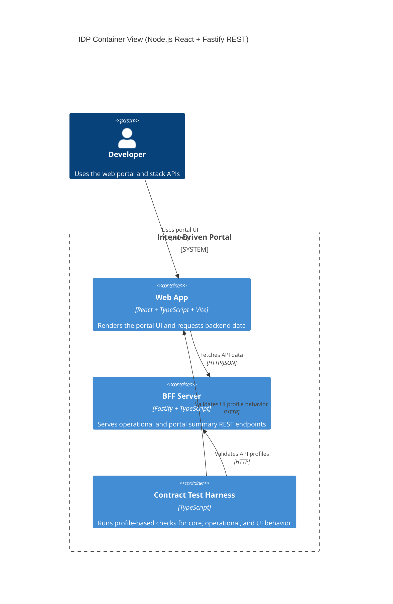

# Level 2: Implementer Containers (Node.js React + Fastify stack)

This view shows the deployable parts of the TypeScript/React reference stack
and the key request paths between browser, SPA host, and BFF.

## Audience

- Primary: IDP implementers and operators.
- Secondary: maintainers reviewing supported stack behavior.

## State

- Current: reflects the active Node.js React + Fastify reference stack.
- Target: aligns to user capability views as those capabilities expand.

## Notes

- User-first Level 2 view lives at [Level 2: User Capability Containers](./level-2-user-capabilities).
- This stack declares `core`, `operational`, and `ui-profile` contract profiles.
- The BFF route set is implemented under `bff/src/routes/`.
