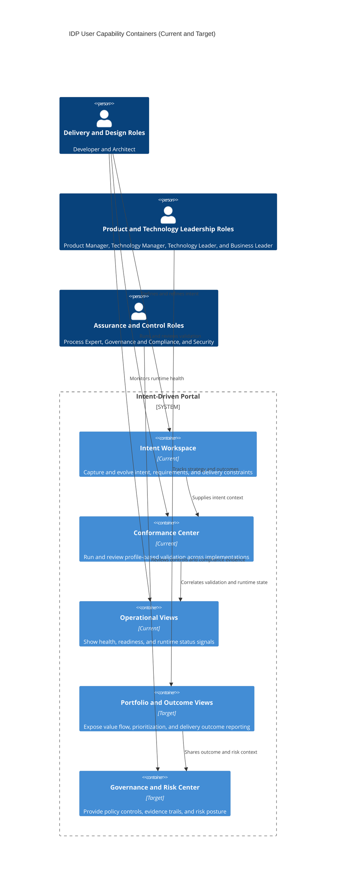

# Level 2: User Capability Containers (Current and Target)

This stack-agnostic Level 2 view shows user-facing capability containers rather
than implementation-specific containers.

## Audience

- Primary: IDP users and decision stakeholders.
- Secondary: implementers aligning architecture to user outcomes.

## State

- Current: delivery intent, conformance visibility, and operations awareness.
- Target: expanded planning, governance, and portfolio outcome capabilities.

## Notes

- This is the primary Level 2 view for users.
- Stack-specific Level 2 container diagrams remain for implementers/operators.
