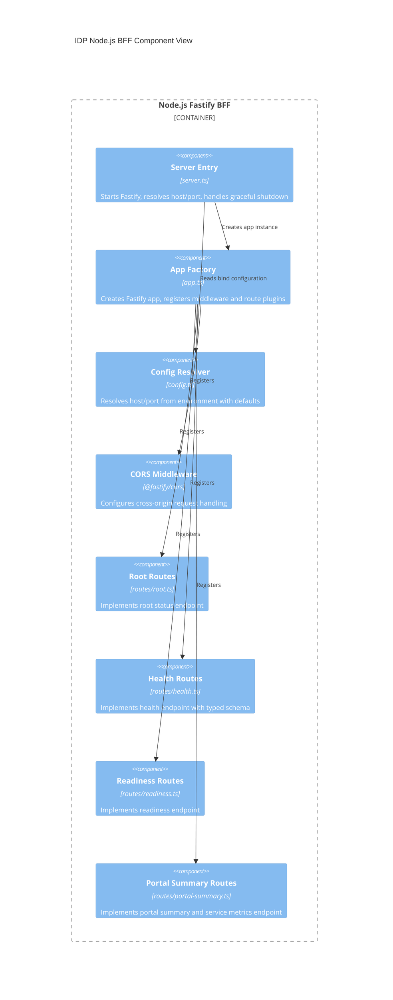

# Level 3: Component View (Node.js BFF)

This view explains how the Node.js BFF is structured internally so implementers
can quickly identify where behavior is configured and where routes are handled.

## Notes

- Route handlers currently expose root, health, readiness, and summary APIs.
- Zod is used in route modules that return structured operational payloads.
