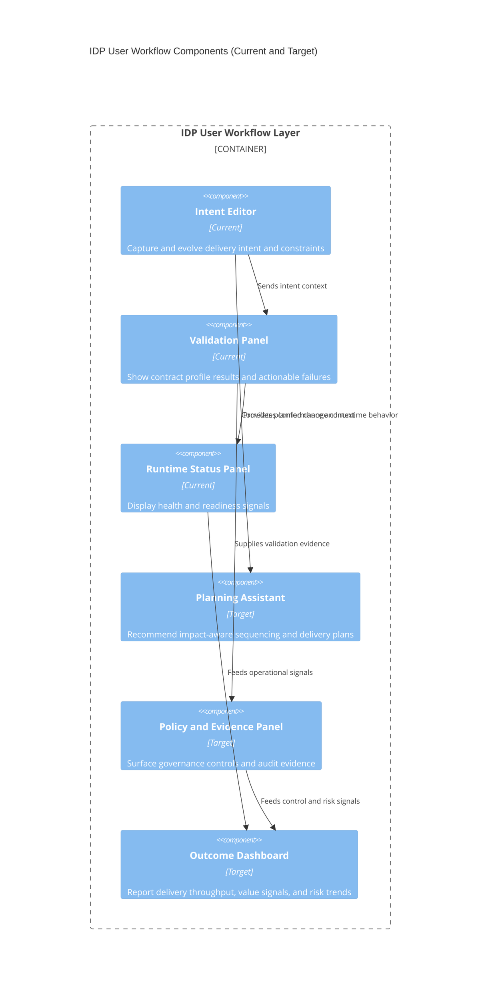

# Level 3: User Workflow Components (Current and Target)

This stack-agnostic Level 3 view models user-facing workflow components instead
of implementation internals.

## Audience

- Primary: IDP users, architects, and product stakeholders.
- Secondary: implementers designing features around user workflow outcomes.

## State

- Current: intent capture, validation review, and runtime visibility workflows.
- Target: guided planning, policy evidence, and outcome management workflows.

## Notes

- Current and target elements are co-located to support roadmap communication.
- Implementation-specific Level 3 views remain separate.
